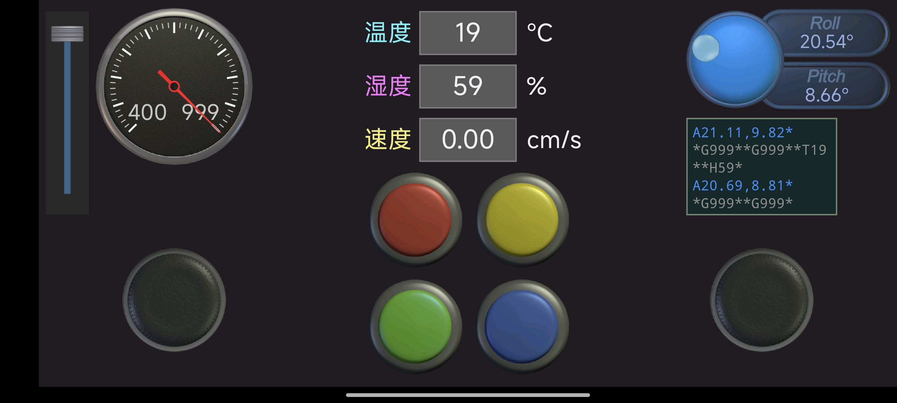

## 课设题目

基于stm32的麦轮避障小车设计

## 主要任务

利用stm32f103最小系统板+相关硬件模块的方式搭建硬件平台，基于stm32库函数进行c语言编程，最终实现避障小车的实地运行。

## 详细功能描述

### 核心功能：

1. 手机app蓝牙遥控功能实现

2. 基于麦克纳姆轮的全向运动系统设计与实现

3. 在小车麦轮遥控功能的基础上迭代，增加**摇头避障、手机重力感应遥控**功能

### 其他功能：

1. 蜂鸣反馈功能
2. 速度检测与显示（测速）
3. 温度检测与显示（测温）

### 项目成果：

手机APP遥控界面展示：

实物展示：

（后期测试中因误操作不慎将stm32f103c8t6最小系统板烧了，这里换用正点原子的stm32f103zet6精英板作为候补，各模块引脚均采用宏定义，故简单改动宏定义引脚即可成功移植到精英板，接线会比较麻烦）

